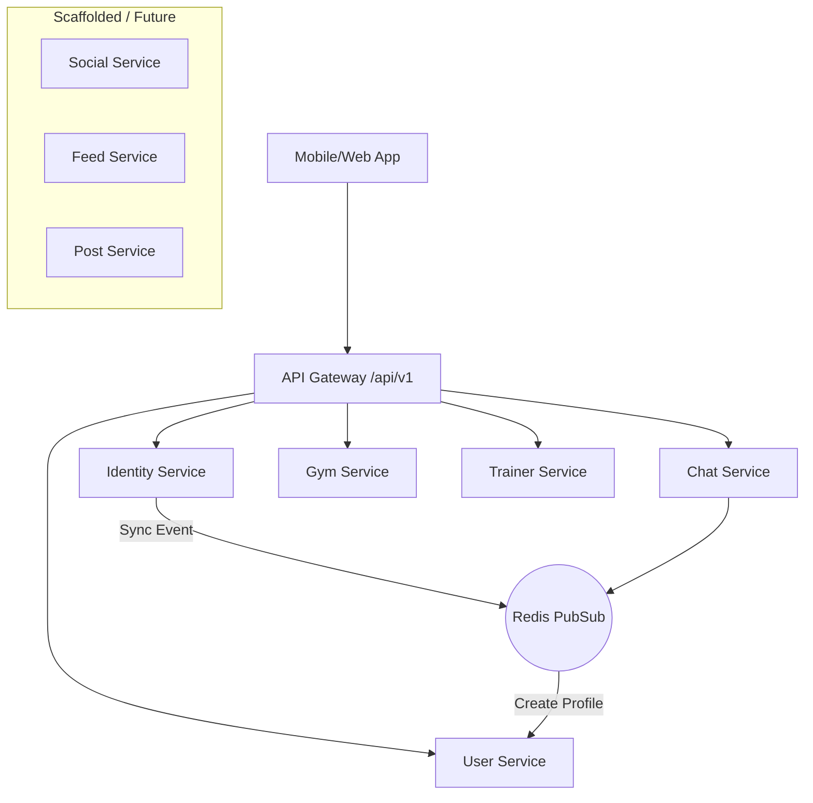

# Gymato Repository Context & Feature Report

## 1. Executive Summary
**Gymato** is a scalable, microservices-based fitness ecosystem designed to connect Users, Gyms, and Trainers. The platform is built using a modern tech stack (Bun, Hono, PostgreSQL, Docker) and follows a clean Distributed Architecture.

**Current Status**: Core infrastructure is established. Authentication, User Management, Gym/Trainer Directories, and Chat functionality are fully implemented and tested. Advanced features (Social Feed, Payments, Workouts) are scaffolded but awaiting implementation.

## 2. Technology Stack
- **Runtime**: [Bun](https://bun.sh/) (High-performance JS runtime)
- **Framework**: [Hono](https://hono.dev/) (Ultra-fast web framework)
- **Database**: PostgreSQL (Per-service logic, currently sharing a dev instance)
- **Caching/Messaging**: Redis (Event bus for sync, caching)
- **Infrastructure**: Docker & Docker Compose (Containerized orchestration)
- **Language**: TypeScript (Strict typing)

## 3. Implemented Services (The "Live" Core)
These services are functional, tested, and integrated via the API Gateway.

### 🔐 Identity Service (`identity-service`)
**Role**: Authentication Authority.
- **Features**:
    - User Registration (Email/Password).
    - Login (JWT issuance).
    - Rate Limiting (Protection against brute force).
    - Login History tracking.
- **Data**: Users table (Credentials).

### 👤 User Service (`user-service`)
**Role**: Profile Management.
- **Features**:
    - Rich User Profiles (Name, Bio, Role).
    - **Event Sync**: Automatically creates profiles when users register in Identity service (via Redis events).
    - Profile Updates.
- **Data**: Profiles table.

### 🏢 Gym Service (`gym-service`)
**Role**: Gym Directory & Management.
- **Features**:
    - Gym Registration & Management.
    - Search functionality.
    - Location support (Address/City).
- **Data**: Gyms table.

### 🏋️ Trainer Service (`trainer-service`)
**Role**: Trainer Directory & Scheduling.
- **Features**:
    - Trainer Profiles.
    - Specializations & Certifications.
    - **Scheduling**: Management of availability slots (Time-slots).
- **Data**: Trainers, Availability tables.

### 💬 Chat Service (`chat-service`)
**Role**: Real-time Communication.
- **Features**:
    - **Direct Messaging**: 1-on-1 chats.
    - **Group Chats**: Multi-user conversations.
    - **Message Management**: Send, Edit, Delete, Read Receipts.
    - **Security**: Participant-only access control.
- **Data**: Conversations, Participants, Messages tables.

### 🌐 API Gateway (`api-gateway`)
**Role**: Unified Logic Entry Point.
- **Features**:
    - Single entry point (`/api/v1`).
    - Route delegation (Proxies requests to appropriate microservices).
    - Authentication verification (Centralized).

## 4. Scaffolded Services (The Roadmap)
These services exist in the repository structure but are currently placeholders awaiting development. They represent the "Next Steps" for the design and engineering teams.

- **Social & Content**:
    - `social-service` (Graph, Likes, Comments)
    - `post-service` (User Content)
    - `feed-service` (Timeline aggregation)
    - `media-service` (Image/Video storage)
- **Commerce**:
    - `payment-service` (Stripe integration)
    - `order-service` (Cart/Checkout)
    - `marketplace-service` (Product store)
    - `subscription-service` (Membership plans)
- **Fitness & Health**:
    - `workout-service` (Plans, Routines)
    - `nutrition-service` (Diet plans)
    - `attendance-service` (Check-ins)
    - `scanner-service` (QR Code entry)
    - `instant-session-service` (On-demand booking)
- **Operations**:
    - `notification-service` (Push/Email)
    - `analytics-service` (Data warehouse)
    - `message-store-service` (Archiving)

## 5. Design Request & Context for Creatives
We need UI/UX designs that unify these distributed capabilities into a cohesive application.

**Key User Flows to Visualize:**
1.  **Onboarding**: Register -> Create Profile -> Select Role (User/Trainer/Gym Owner).
2.  **Discovery**:
    - Browse/Search Gyms near me.
    - Browse/Filter Trainers by specialization.
3.  **Communication**:
    - "Message Trainer" button on profile -> Opens Chat 1-on-1.
    - "Gym Community" Group Chat entry.
4.  **Social (Upcoming)**:
    - User Feed showing posts from followed Trainers/Gyms using the upcoming Hybrid Feed architecture.
    - Stories strip at the top of the feed.

## 6. Architecture Diagram (Conceptual)

## 7. How to Run (For Devs/QA)
1.  **Prerequisites**: Docker, Bun.
2.  **Start System**: `bun run docker:up` (Starts all implemented services).
3.  **Verify**: `bun run tools/verify-sync.ts` (Runs E2E Integration tests).
